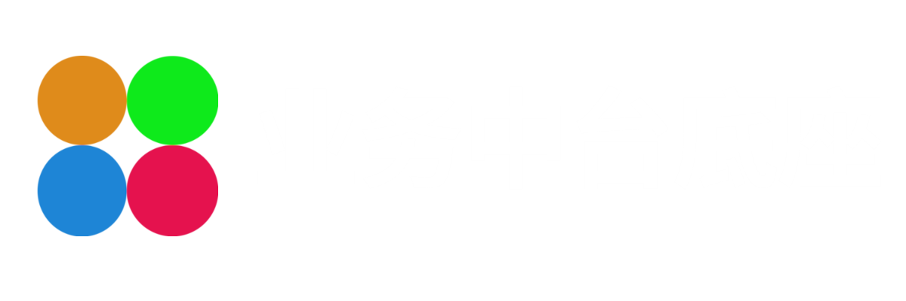

# Byteasy 易码之道（码道）

## 一、项目简介

1.1 项目概述
- 项目全称：Byteasy（易码之道/码道）
- 项目定位：企业级业务中台技术底座、通用后台管理开源平台
- 核心初衷：整合开源技术、提供一致性的使用体验、建造标准的软件积木、将经验沉淀为“车轮”
- 设计理念：模块化解耦、组件化复用、低耦合、技术栈最小依赖，实现“积木式”标准化开发，告别重复造轮子

1.2 核心价值
- 架构层面统一研发规范，大幅提升项目交付效率
- 通用能力高度复用，降低多业务线研发、运维、迭代成本
- 前后端完全解耦，支持独立开发、快速迭代、灰度发布
- 适配企业级多场景业务，兼容性、可扩展性强

## 二、架构介绍

2.1 前端架构
- 架构模式：乾坤微前端架构，分为通用前端底座 + 各领域前端应用双层结构
- 核心能力：基座统一管控、业务应用独立开发、按需加载部署
- 核心技术栈：Vue3、Element Plus
- 技术优势：开发效率高、界面统一、交互体验优质，配套前端构件技术，提取公共标准组件

2.2 后端架构
- 架构体系：Spring Cloud Alibaba 主流微服务体系
- 分层原则：平台共性能力 + 垂直业务领域分层拆解
- 工程管理：Maven构件、微服务模块化拆分，代码分层治理
- 核心能力：中台通用技术、业务能力横向复用，保障多业务线技术统一，支撑快速落地迭代

2.3 部署架构
- 流量网关：APISIX（高性能云原生网关）
- 网关能力：路由转发、权限管控、流量限流、负载均衡
- 部署模式：前后端代码捆绑打包、一体化部署发布
- 运维优势：简化发布流程、保障前后端版本一致、降低运维复杂度，支持服务独立迭代、灰度上线、快速故障定位

## 三、核心功能特性
- 权限体系：基于RBAC模型，支持用户、用户组、组织多维度细粒度授权,页面支持到按钮级别权限
- 基础管理：完善的组织管理、用户管理功能
- 第三方集成：基于Spring Auth2标准实现，支持OIDC、OAuth2协议，便捷对接第三方系统
- 接口权限：OpenApi接口级权限管控，适配第三方应用接入
- 微前端管控：独立的微前端应用管理能力，适配多应用部署场景
- 系统运维：全量审计日志、标准化数据字典管理
- 低代码引擎：提供一致体验的低代码引擎、表单引擎，助力业务快速落地
- 集成平台：提供数据流编排能力，方便与第三方系统快速集成

## 四、版本规划（Roadmap）

- 集成平台
- BPM
- MQ
- IoT
- 业务领域应用

## 五、在线体验

- admin/admin123
- 演示地址:[https://www.byteasy.cn](https://www.byteasy.cn)
- 文档地址:[https://doc.byteasy.cn](https://doc.byteasy.cn)

## 六、开源仓库地址
6.1 Github传送地址

| 模块              | 说明       | 地址                                         |
|-----------------|----------|--------------------------------------------|
| cloud-framework | 通用共性基础框架 | https://github.com/byteasy/cloud-framework |
| cloud-platform  | 平台基础服务   | https://github.com/byteasy/cloud-platform  |
| ui-app          | 前端代码仓    | https://github.com/byteasy/ui-app          |

6.2 Gitee传送地址

| 模块              | 说明       | 地址                                          |
|-----------------|----------|---------------------------------------------|
| cloud-framework | 通用共性基础框架 | https://gitee.com/byteasy/cloud-framework |
| cloud-platform  | 平台基础服务   | https://gitee.com/byteasy/cloud-platform  |
| ui-app          | 前端代码仓    | https://gitee.com/byteasy/ui-app          |

## 七、快速开始

7.1 环境依赖
- 前端：nodejs v24.12.0、Vue3
- 后端：java 21 spring boot：3.5.9 spring cloud alibaba：2025.0.0.0 mybatis plus：3.5.16
- 中间件：Maven、Postgres、Apisix:3.14.1、Nacos:3.1.1

7.2 项目克隆
- 本项目基础仓库分三个：cloud-framework、cloud-platform、ui-app

7.3 环境初始化
- Postgres数据库导出文件：[数据导入文件](https://github.com/byteasy/cloud-platform/blob/main/doc/schema/pg/byteasy.sql)
- Postgres数据库自动导入脚本:[脚本](https://github.com/byteasy/cloud-platform/blob/main/doc/sh/restore.sh),注意其中的域名www.byteasy.cn，要改为自己的域名，如果没有，随便起一个，
  在host文件中增加一个映射.

7.4 前后端打包
- [一键打包脚本](https://github.com/byteasy/cloud-platform/blob/main/doc/sh/autoDeploy.sh) 打包步骤可参照此演示后台的自动部署脚本

